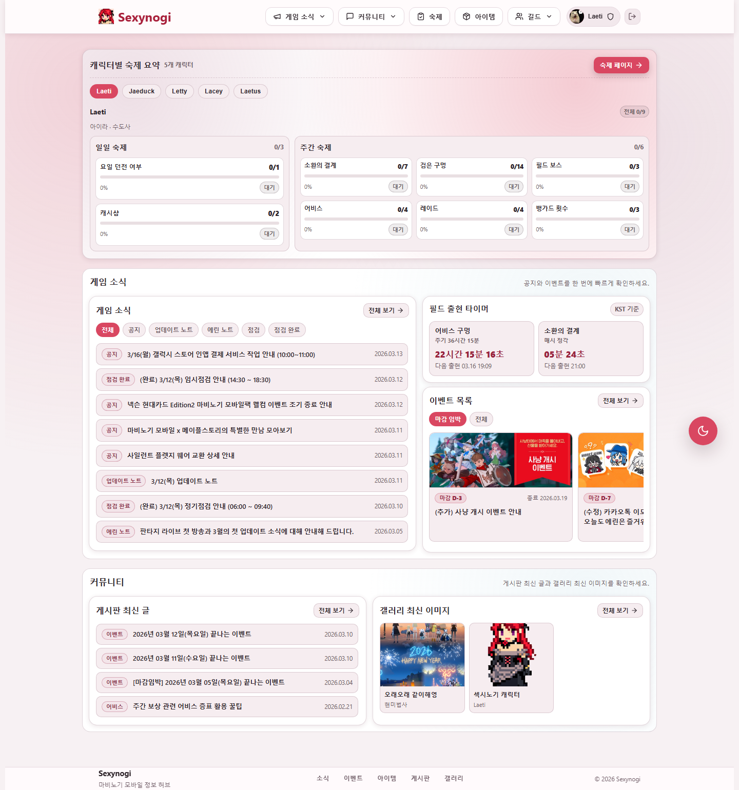
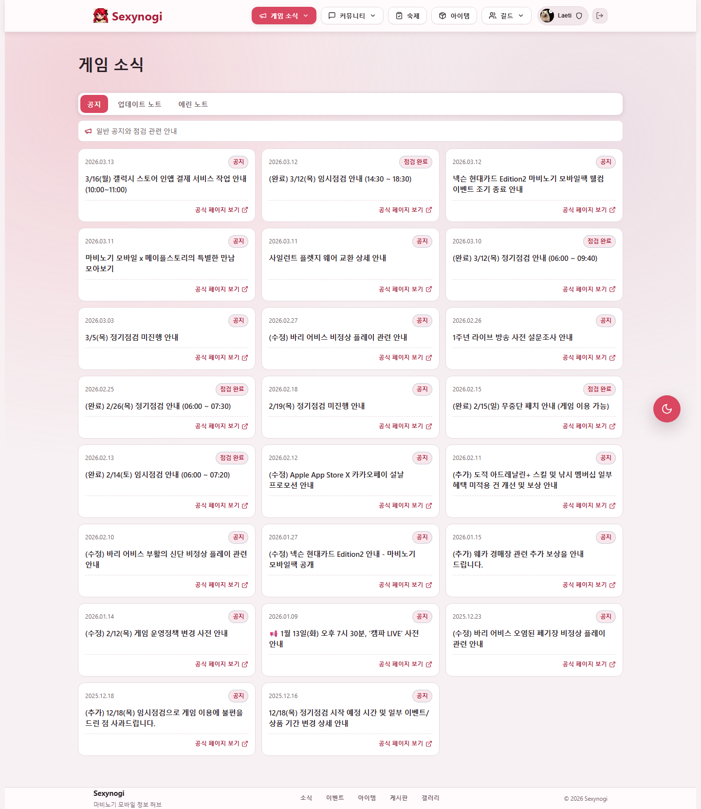
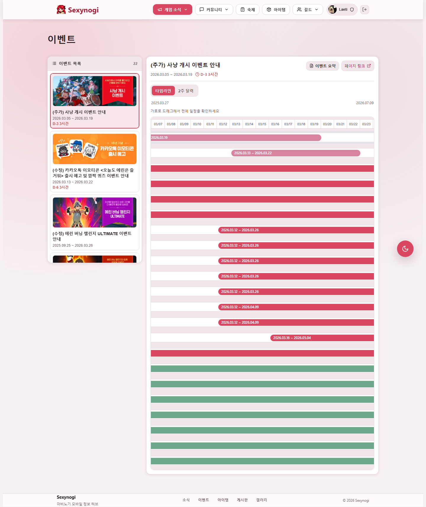
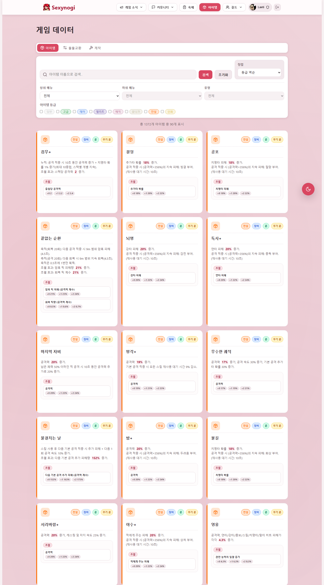
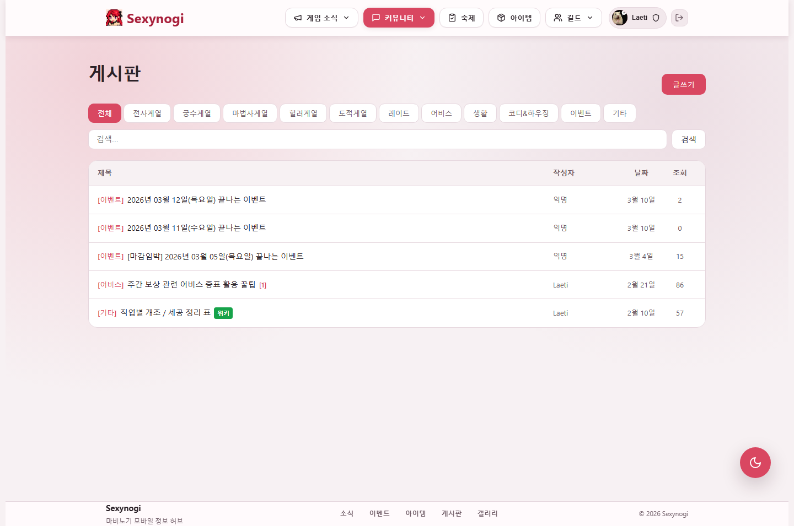
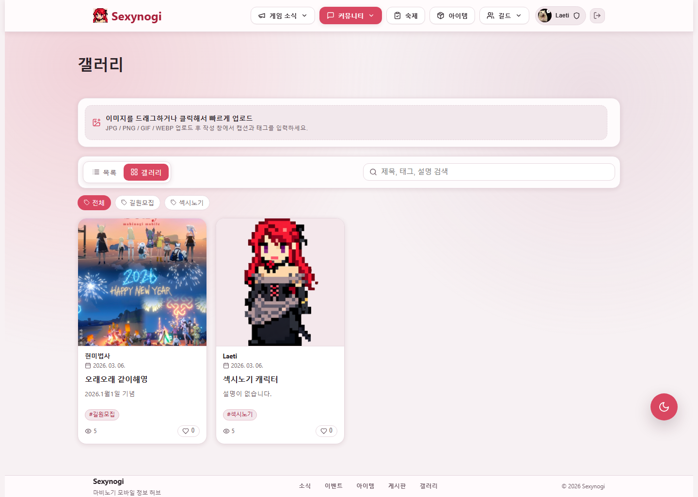
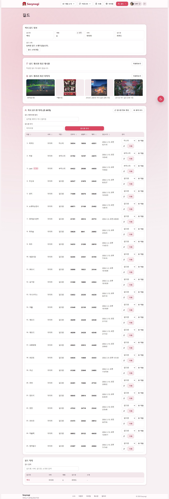
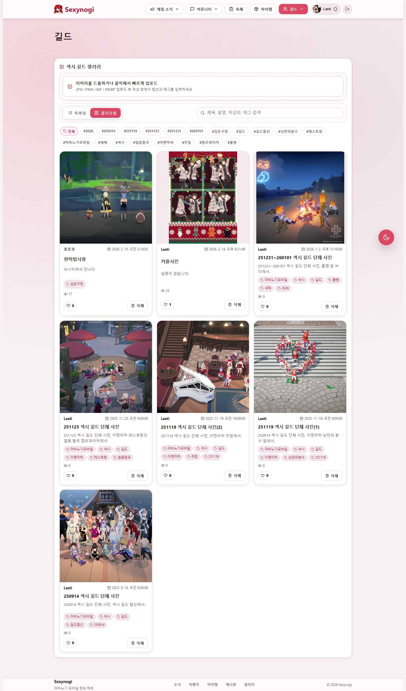
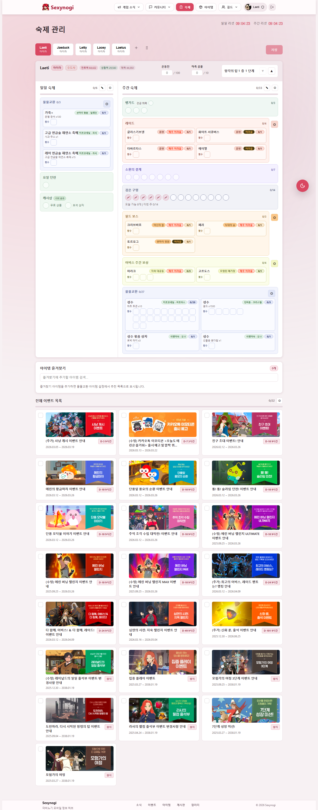

# Sexynogi Frontend

> 마비노기 유저를 위한 커뮤니티, 길드, 게임 데이터 탐색 기능을 하나의 흐름으로 묶은 React + Vite 기반 SPA입니다. 뉴스와 이벤트 확인, 아이템 검색, 게시판과 갤러리, 길드 공간, 캐릭터와 TODO 관리까지 프론트엔드에서 자연스럽게 이어집니다.

<p align="left">
  
  
  
  
  
  
</p>

## 바로 보기

- [핵심 기능](#핵심-기능)
- [프로젝트 구조](#프로젝트-구조)
- [시작하기](#시작하기)
- [주요 라우트](#주요-라우트)
- [URL 규칙](#url-규칙)
- [화면 미리보기](#화면-미리보기)
- [관련 문서](#관련-문서)

## 핵심 기능

- `뉴스/이벤트`: 공지, 업데이트 노트, 에린 노트, 이벤트를 카테고리별로 탐색합니다.
- `게임 데이터`: 아이템, 교역, 제작 정보를 검색하고 상세 화면으로 이어집니다.
- `커뮤니티`: 게시판과 갤러리에서 목록, 상세, 작성 흐름을 제공합니다.
- `길드 공간`: 기본 길드와 특정 길드 페이지를 동일한 URL 패턴으로 탐색합니다.
- `개인 관리`: 캐릭터, 프로필, TODO 기능으로 사용자 정보를 관리합니다.

## 프로젝트 구조

| 경로 | 설명 |
| --- | --- |
| `src/app.tsx` | 라우팅과 공통 레이아웃의 진입점 |
| `src/pages/` | 라우트 단위 페이지 |
| `src/components/` | 공통 UI 컴포넌트 |
| `src/services/` | 백엔드 API 호출 모듈 |
| `src/contexts/` | 인증 및 전역 상태 컨텍스트 |
| `src/hooks/` | 재사용 가능한 커스텀 훅 |
| `src/features/`, `src/utils/`, `src/config/` | 도메인 로직, 유틸리티, 설정 코드 |
| `src/types/`, `src/styles/`, `src/assets/` | 타입 정의, 스타일, 정적 리소스 |

## 시작하기

```bash
npm install
npm run dev
```

| 명령어 | 설명 |
| --- | --- |
| `npm run dev` | 개발 서버 실행 |
| `npm run dev:prod` | 프로덕션 모드 기준 로컬 실행 |
| `npm run build` | 프로덕션 빌드 |
| `npm run build:dev` | 개발 모드 빌드 |
| `npm run preview` | 빌드 결과 미리보기 |
| `npm run preview:prod` | 프로덕션 모드 미리보기 |
| `npm run lint` | ESLint 검사 |

## 주요 라우트

| 영역 | 경로 | 설명 |
| --- | --- | --- |
| 홈 | `/` | 메인 허브와 주요 진입 화면 |
| 뉴스 | `/news/notice`, `/news/update-note`, `/news/erin-note`, `/news/events` | 공식 소식과 이벤트 탐색 |
| 게임 데이터 | `/items`, `/barter`, `/craft`, `/items/:itemName/detail` | 아이템, 교역, 제작 검색 및 상세 |
| 커뮤니티 | `/board`, `/board/:postSlug`, `/board/write`, `/board/edit/:postId` | 게시판 목록, 상세, 작성, 수정 |
| 갤러리 | `/gallery`, `/gallery/:postTitle` | 사진형 커뮤니티 콘텐츠 |
| 길드 | `/guild`, `/guild/gallery`, `/guild/board` | 기본 길드 공간 |
| 길드별 페이지 | `/guild/:guildName`, `/guild/:guildName/gallery`, `/guild/:guildName/board` | 특정 길드 단위 탐색 |
| 사용자 | `/characters`, `/profile`, `/todo` | 캐릭터, 프로필, TODO 관리 |

로그인이 필요한 경로는 `/profile`, `/todo`, `/board/write`, `/board/edit/:postId`, `/guild/board/write`, `/guild/:guildName/board/write` 입니다.

## URL 규칙

- 갤러리 상세 페이지는 제목 기반 slug를 경로로 사용합니다.
- 제목의 공백은 `-`로 치환하여 URL에 반영합니다.
- 모달에서 상세 화면을 열어도 새로고침 시 독립 상세 페이지로 진입할 수 있습니다.
- 일부 레거시 또는 축약 경로는 현재 라우트로 리다이렉트됩니다.
  예: `/news` -> `/news/notice`, `/events` -> `/news/events`, `/items/barter` -> `/barter`

## 화면 미리보기

<table>
  <tr>
    <td align="center" width="33%">
      
      <br />
      <strong>홈</strong>
      <br />
      <sub>주요 콘텐츠 진입 허브</sub>
    </td>
    <td align="center" width="33%">
      
      <br />
      <strong>뉴스</strong>
      <br />
      <sub>공지와 업데이트 탐색</sub>
    </td>
    <td align="center" width="33%">
      
      <br />
      <strong>이벤트</strong>
      <br />
      <sub>진행 중 이벤트 확인</sub>
    </td>
  </tr>
  <tr>
    <td align="center" width="33%">
      
      <br />
      <strong>아이템</strong>
      <br />
      <sub>아이템, 교역, 제작 정보 검색</sub>
    </td>
    <td align="center" width="33%">
      
      <br />
      <strong>게시판</strong>
      <br />
      <sub>커뮤니티 글 탐색과 작성</sub>
    </td>
    <td align="center" width="33%">
      
      <br />
      <strong>갤러리</strong>
      <br />
      <sub>사진형 게시물 중심 탐색</sub>
    </td>
  </tr>
  <tr>
    <td align="center" width="33%">
      
      <br />
      <strong>길드</strong>
      <br />
      <sub>길드 홈과 길드 정보</sub>
    </td>
    <td align="center" width="33%">
      
      <br />
      <strong>길드 갤러리</strong>
      <br />
      <sub>길드별 이미지 아카이브</sub>
    </td>
    <td align="center" width="33%">
      
      <br />
      <strong>TODO</strong>
      <br />
      <sub>개인 작업과 할 일 관리</sub>
    </td>
  </tr>
</table>

## 관련 문서

- 프론트 API 호출 맵: [src/README.md](./src/README.md)
- 백엔드 REST API 문서: [../src/README.md](../src/README.md)
